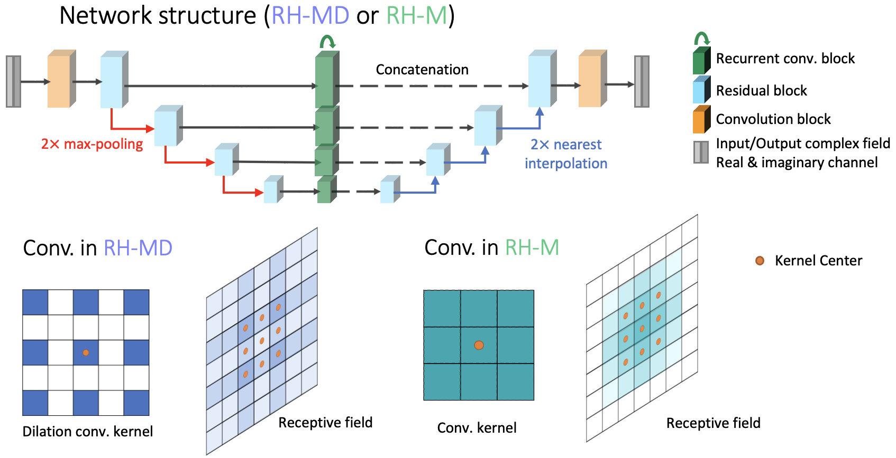

# Convolutional Recurrent Neural Network



Code repository for:
```
Huang, L., Chen, H., Luo, Y. et al. Recurrent neural network-based volumetric fluorescence microscopy. Light Sci Appl 10, 62 (2021). https://doi.org/10.1038/s41377-021-00506-9

Huang L., Liu T. et al. Holographic Image Reconstruction with Phase Recovery and Autofocusing Using Recurrent Neural Networks. ACS Photonics 2021 8 (6), 1763-1774
https://doi.org/10.1021/acsphotonics.1c00337

Huang L., Yang X. et al. Few-shot transfer learning for holographic image reconstruction using a recurrent neural network. APL Photonics 7, 070801 (2022) https://doi.org/10.1063/5.0090582
```

The proposed network architure was shared for [Recurrent-MZ](https://www.nature.com/articles/s41377-021-00506-9) and [RH-M](https://pubs.acs.org/doi/full/10.1021/acsphotonics.1c00337) models.

## Reproduction
This folder contains the training and transfer learning codes of RH-M, plus a pre-trained backbone model as introduced in the paper.

Train:
Run "train.py". Before training, fill in the path of your own dataset. Dataset should be formatted as .mat files. Each .mat file has "inputData" and "targetData" variables, and the variables are arranged as 3-dim arrays ($H\times W\times C$).
Input dimension: $H\times W\times 2M$. Here H, W are the height and width of the input holograms respectively, M is the number of input holograms. Inputs are zero-phase back-propagated holograms in real and imaginary channels.
Target (GT) dimension: $H\times W\times 2$. Real and imaginary channels of the GT complex field.

Transfer:
Run "train_transfer.py". Before transfer learning, set the training dataset path for transfer learning. Dataset should be formatted in the same way as training.

Test:
Run "test.py". Before testing, set the testing dataset path. Dataset should be formatted in the same way as training.

## Test demo
A [demo](https://drive.google.com/drive/folders/1wsVNZEdmN3YW2eusz1t_zk7NJWuP3ePU?usp=share_link) contains 3 testing FOVs of human tissue sections and the corresponding standard RH-M model (specific for one certain sample type).

The backbone model (transferrable to various sample types) can be downloaded [here](https://drive.google.com/drive/folders/1OG6MVnZuI1e9ugbzVl7WOnvwpfyFWXQ5?usp=sharing).